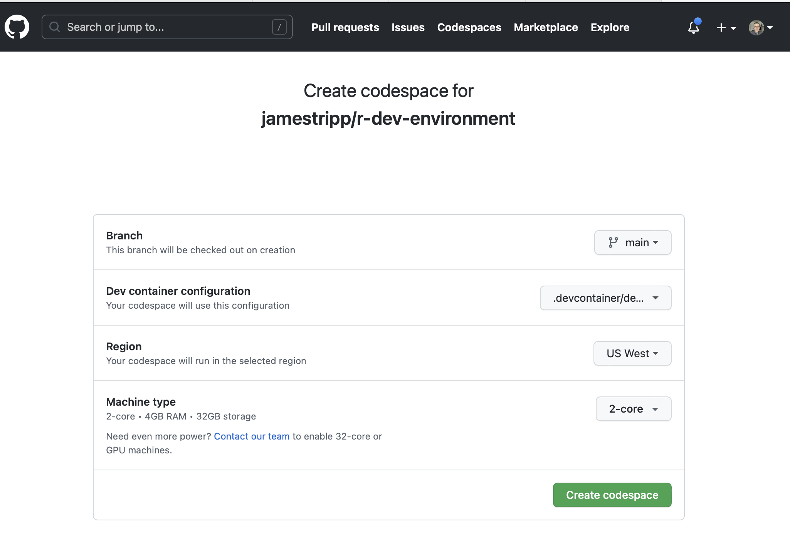
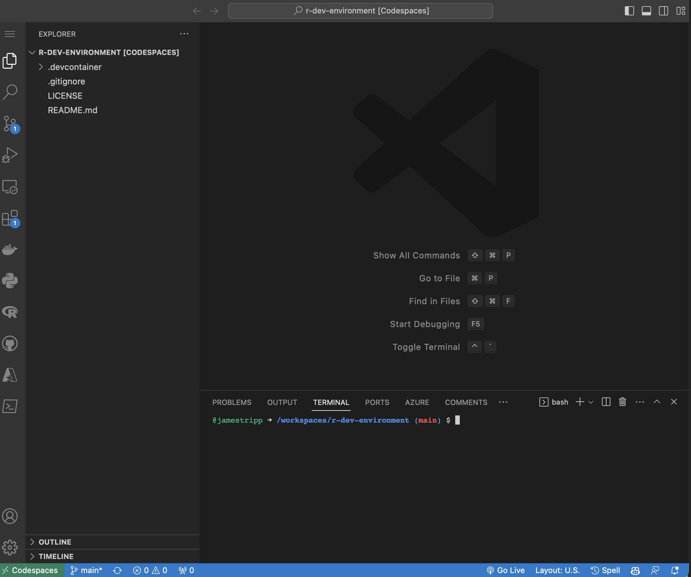
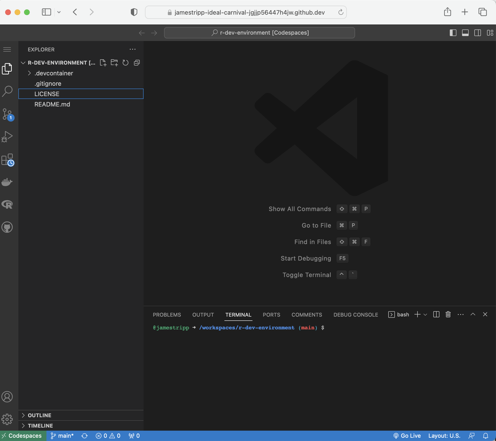
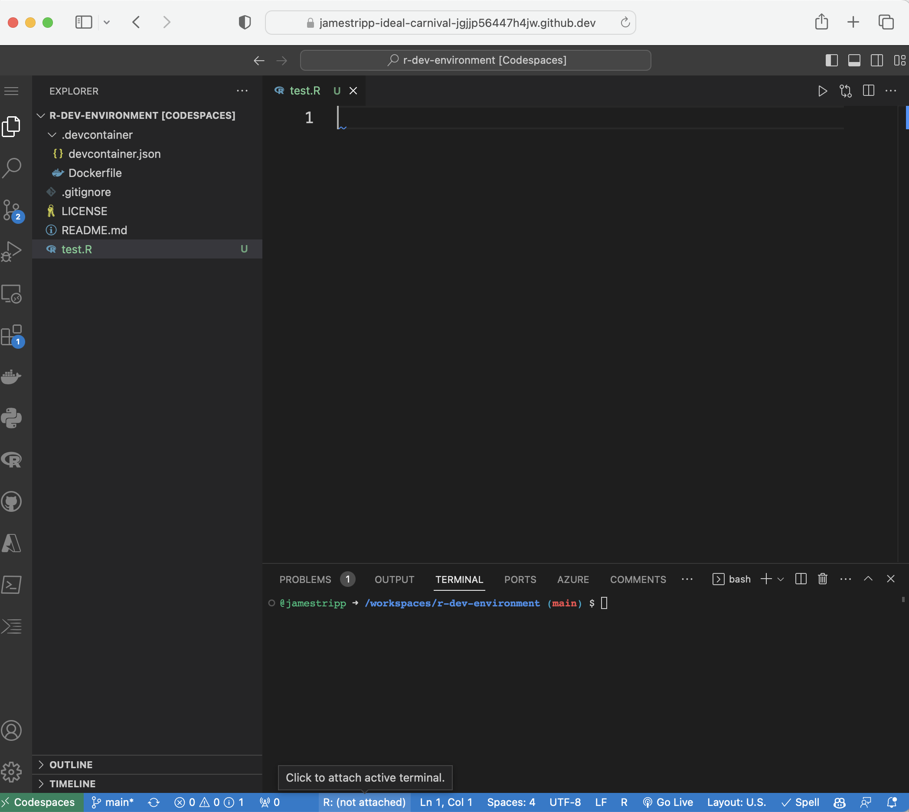

# R Dev Container

[](https://github.com/codespaces/new?hide_repo_select=true&ref=main&repo=613269999&machine=premiumLinux&devcontainer_path=.devcontainer%2Fdevcontainer.json&location=WestUs2)

A containerised development environment for editing and compiling the R source code. The environment contains the VSCode IDE and tools needed to compile R.

## Getting started

You can run this environment on GitHub using [codespaces](https://github.com/features/codespaces)

### Codespaces

Click on the 'Open in GitHub Codespaces' button and then click the green 'Create Codespace' button.

<p align="center">
    
</p>


The codespace setup screen will then be shown. Starting the container may take a minute or so.

<p align="center">
    
</p>


You will be taken to a VSCode editor within your browser.

<p align="center">
    
</p>

## Running R

Create a file in VS Code ending with a .R extension. You can create new files by clicking on the new file icon in VS Code.

<p align="center">
    
</p>

Open the file by clicking on the filename. You should see R:(note attached) in the bottom bar.

<p align="center">
    
</p>

Click on the R:(note attached) button to launch R in the terminal. You can then send code from the .R file to the termianl r by pressing cmd + enter.

<p align="center">
    
</p>

## R Contribution Workflow

### Build Setup
1. Environment Variables
    - We have environment variables for setting the paths for building R and storing the source code.
    - The path ENV variable for R Build and R Source code are BUILDDIR and TOP_SRCDIR respectively.
    - The environment variables are set in the codespace image and are available when the codespace starts.
      
      
2. svn checkout
   - The svn checkout cmd lets us create working of a repository with specific tag/branch.
   - Example:
    ```bash
     svn checkout https://svn.r-project.org/R/trunk/ "$TOP_SRCDIR"
     ```
   - Output : We get file structure something like this after checking out R source code from R svn repository.
     

3. cd to BUILDDIR
   - We need to change our directory to R build directory(BUILDDIR) to build and configure our R source code.
   - First we will create a directory using env var BUILDDIR.
     ```bash
     mkdir -p $BUILDDIR
     ```
   - Then we can change directory from root to $BUILDDIR one.
    ```bash
      cd $BUILDDIR
    ```
4. configure source code
   - After we change directory to BUILDDIR we can configure and build R.
   - ```bash
     "$TOP_SRCDIR/configure" --enable-R-shlib --without-recommended-packages
     make
     sudo make install
     ```
   - The configure cmd prepares for building R, creating files and folders inside the BUILDDIR directory.
   - Output : We get file structure something like this after using configure command.
     
     

5. After having built the current development version of R, we can now make changes in source code and make our contributions.

### Contribution Workflow

1. Example Contribution Workflow using DevContainer:
   -  To start working in R we will click on `R:(not attach)` option which is in the bottom right of our R-dev codespace. It will open R terminal for us.
     
       
       

   -  We can now run R commands. We will use the `utils::askYesNo()` function as an example
      ```R
      > askYesNo("Is this a good example?")
      Is this a good example? (Yes/no/cancel) Yes
      [1] TRUE
      ```
 2. Edit the source code of `utils::askYesNo()` to change the default options. The source code can be found in `$BUILDDIR/src/library/utils/R/askYesNo.R`. Before edit:
    ```R
    prompts = getOption("askYesNo", gettext(c("Yes", "No", "Cancel"))),
    ```
       With edit (for example - change to whatever you like!):
     ```R
      prompts = getOption("askYesNo", gettext(c("Oh yeah!", "Don't think so", "Cancel"))),
     ```
 3. Re-build the utils package (we only need to re-build the part we have modified). We can rebuild the package by following simple steps
    - First we need to be inside $BUILDDIR, for that we can change directory to `cd $BUILDDIR`.
    - After that we can run cmd `make` and `sudo make install` in a series.  This will re-build any parts of R that have changed, in this case only re-building the utils package, then re-install R. If we open a new R terminal we will see our changes getting reflected.
 4. Check the edit has worked as expected by re-running the example code:
    ```R
    > askYesNo("Is this a good example?")
    Is this a good example? (Oh yeah!/don't think so/cancel) Oh yeah!
    [1] TRUE
    ```
## Useful Links

* [R in Visual Studio code](https://code.visualstudio.com/docs/languages/r)

* [VSCode R Wiki](https://github.com/REditorSupport/vscode-R/wiki)

* [Getting started with Dev Containers](https://code.visualstudio.com/docs/devcontainers/tutorial)

* [Install Docker Desktop](https://www.docker.com/products/docker-desktop/)

* [Installing Docker on Linux](https://docs.docker.com/desktop/install/linux-install/)

* [Dev Container Documentation](https://code.visualstudio.com/docs/devcontainers/containers)
