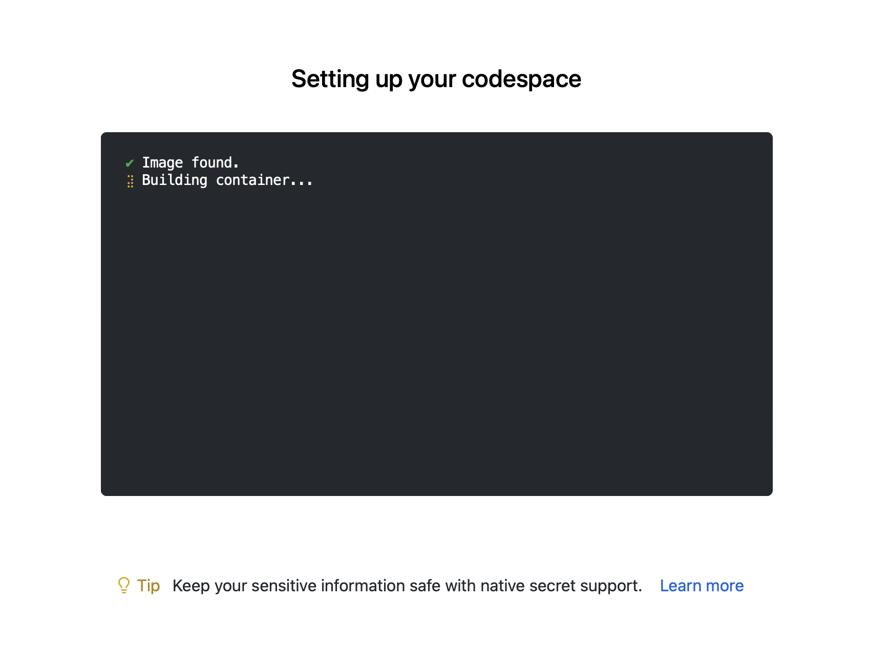

# R Dev Container

[](https://www.repostatus.org/#wip)

[](https://codespaces.new/r-devel/r-dev-env)

A containerised development environment for editing and compiling the R source code. The environment contains the VSCode IDE and tools needed to compile R.

## Getting started

You can run this environment on GitHub using [codespaces](https://github.com/features/codespaces)

### Codespaces

Click on the 'Open in GitHub Codespaces' button and then click the green 'Create Codespace' button.

> You will see the message "Codespace usage for this repository is paid for by ...", with your username. Don't panic!
> 
> **Note : Github Codespaces offers 120 core hours of free usage per month for every Github user. So the actual number of free hours is 120 divided by the number of cores you are using to run your codespaces.**
>
> **Here for the R-dev-env codespace we have set the codespace usage to 4 cores which leads to 30hrs of free usage per month. And it can also be changed according to your preference.**
> 
> For more details about codespaces billing, see the [Codespaces Billing Docs](https://github.com/features/codespaces). You can calculate your GitHub services usage with the [GitHub Services Pricing Calculator](https://github.com/pricing/calculator) and check your usage allowance under "Codespaces" on https://github.com/settings/billing.


The codespace setup screen will then be shown. Starting the container may take a minute or so.

<p align="center">
    
</p>


You will be taken to a VSCode editor within your browser.


## Running R

Create a file in VS Code ending with a .R extension. You can create new files by clicking on the new file icon in VS Code.


Open the file by clicking on the filename. You should see R:(not attached) in the bottom bar.


Click on the R:(not attached) button to launch R in the terminal. You can then send code from the .R file to the R terminal by pressing cmd/ctrl + enter.


## R Contribution Workflow

### Build Setup
1. Environment Variables
    - We have environment variables for setting the paths for building R and storing the source code.
    - The path ENV variable for R Build and R Source code are BUILDDIR and TOP_SRCDIR respectively.
    - The environment variables are set in the codespace image and are available when the codespace starts.
      
      
2. svn checkout
   - The svn checkout cmd lets us create working of a repository with specific tag/branch.
   - Example:
      ```bash
       svn checkout https://svn.r-project.org/R/trunk/ "$TOP_SRCDIR"
      ```
   - Output : We get file structure something like this after checking out R source code from R svn repository.
     

3. cd to BUILDDIR
   - We need to change our directory to R build directory(BUILDDIR) to build and configure our R source code.
   - First we will create a directory using env var BUILDDIR.
     ```bash
     mkdir -p $BUILDDIR
     ```
   - Then we can change directory from root to $BUILDDIR one.
     ```bash
      cd $BUILDDIR
     ```
4. configure source code
   - After we change directory to BUILDDIR we can configure and build R.
   - CMD
     ```bash
     "$TOP_SRCDIR/configure" --enable-R-shlib --without-recommended-packages
     make
     sudo make install
     ```
   - The configure cmd prepares for building R, creating files and folders inside the BUILDDIR directory.
   - Output : We get file structure something like this after using configure command.
     
     

5. After having built the current development version of R, we can now make changes in source code and make our contributions.

### Contribution Workflow

1. Example Contribution Workflow using DevContainer:
   -  To start working in R we will click on `R:(not attach)` option which is in the bottom right of our R-dev codespace. It will open R terminal for us.
     
       
       

   -  We can now run R commands. We will use the `utils::askYesNo()` function as an example
      

      ```R
      > askYesNo("Is this a good example?")
      Is this a good example? (Yes/no/cancel) Yes
      [1] TRUE
      ```
 2. Edit the source code of `utils::askYesNo()` to change the default options. The source code can be found in `$TOP_SRCDIR/src/library/utils/R/askYesNo.R`.
    
     **File Opening tip** : If you are known to file path. Here we have file `askYesNo.R` in which we have to make changes and path to that file is known to us which is `$TOP_SRCDIR/src/library/utils/R/askYesNo.R`.
     We can just use cmd `code path_to_file` and codespaces will open us that file without having to open and search for different directories.
    
     Example : `code $TOP_SRCDIR/src/library/utils/R/askYesNo.R`
    
    Before edit:
    

    ```R
    prompts = getOption("askYesNo", gettext(c("Yes", "No", "Cancel"))),
    ```
    With edit (for example - change to whatever you like!):
    

     ```R
      prompts = getOption("askYesNo", gettext(c("Oh yeah!", "Don't think so", "Cancel"))),
     ```
 4. Re-build the utils package (we only need to re-build the part we have modified). We can rebuild the package by following simple steps
    - First we need to be inside $BUILDDIR, for that we can change directory to `cd $BUILDDIR`.
    - After that we can run cmd `make` and `sudo make install` in a series.
      

      


    - This will re-build any parts of R that have changed, in this case only re-building the utils package, then re-install R. If we open a new R terminal we will see our changes getting reflected.
 5. Check the edit has worked as expected by re-running the example code:
    

    ```R
    > askYesNo("Is this a good example?")
    Is this a good example? (Oh yeah!/don't think so/cancel) Oh yeah!
    [1] TRUE
    ```

## Stopping and Restarting Codespaces
#### How to Stop Codespaces?
- To stop codespaces we just need to navigate to Codespaces option which is present in the bottom left of the Codespaces panel.
   
- After clicking on codespaces option we will get a drop down above something like this👇
  
- Click on "Stop Current Codespace". It will stop the codespaces you are currently using or running.
- You will be redirected to Restart Codespaces link that you just stopped.
  

#### How to Restart Codespaces again?
  > Since we have stopped the codespaces, the code changes and operations we have performed inside the codespaces will still be present. The codespaces also have session time limt example if you dont use codespaces for 20-30 mins its get stopped automatically. And you can restart the codespaces showed below 
- Lets see how we can restart the codespaces again.
- To restart codespaces again we can go to this link https://github.com/codespaces
- Here we can see list our codespaces we have created
  
- Currently, here we have one codespaces that we just stopped few seconds ago.
- To restart it, we can just click on the codespaces we wanted to use and it will start the codespaces again for us.
- You can also see an active label added to the codespaces we just started
  


   
## Useful Links

* [R in Visual Studio code](https://code.visualstudio.com/docs/languages/r)

* [VSCode R Wiki](https://github.com/REditorSupport/vscode-R/wiki)

* [Getting started with Dev Containers](https://code.visualstudio.com/docs/devcontainers/tutorial)

* [Install Docker Desktop](https://www.docker.com/products/docker-desktop/)

* [Installing Docker on Linux](https://docs.docker.com/desktop/install/linux-install/)

* [Dev Container Documentation](https://code.visualstudio.com/docs/devcontainers/containers)
