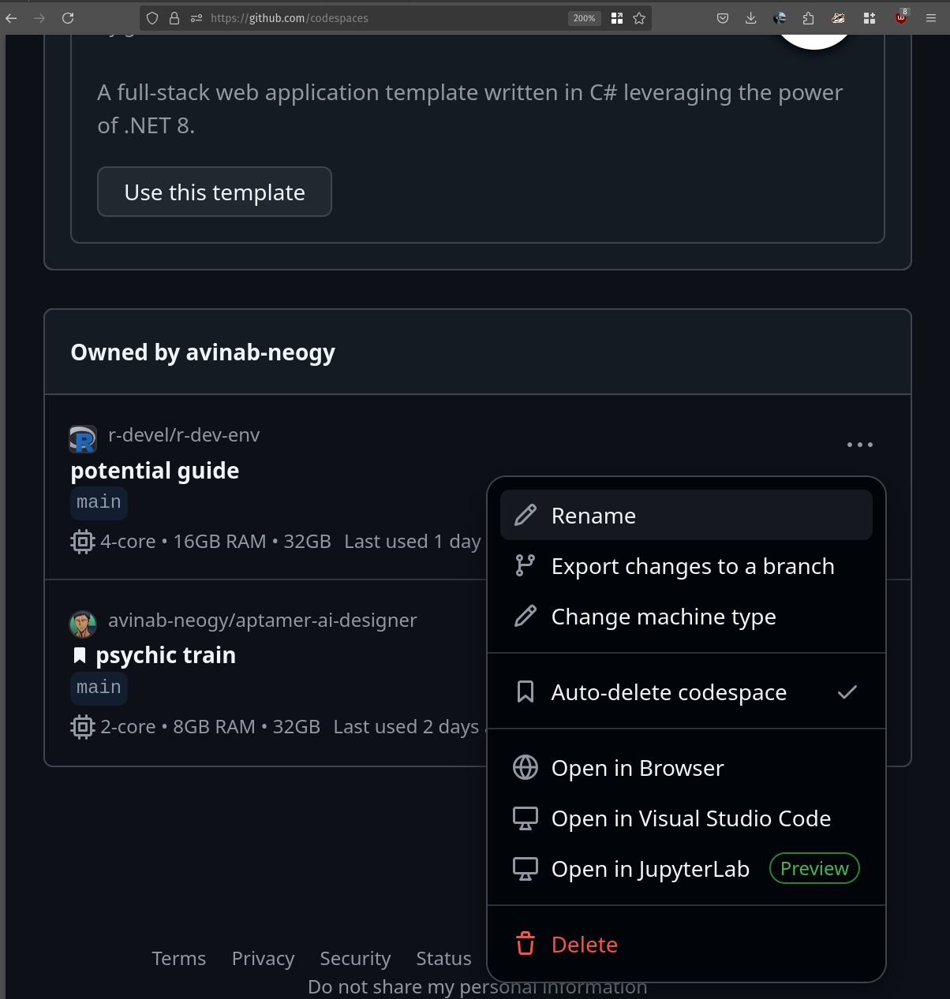

1. From the main branch of the [r-dev-env
repo](https://github.com/r-devel/r-dev-env/tree/main), click on the 'Open in
GitHub Codespaces' button and then click the green 'Create Codespace' button.

    !!! Note You will see the message "Codespace usage for this repository is
        paid for by ...", with your username. Don't panic!

        GitHub Codespaces offers 120 core hours of free usage per month for every GitHub user. So the actual number of free hours is 120 divided by the number of cores you are using to run your codespaces.
        For the r-dev-env codespace we have set the codespace usage to 4 cores which leads to 30hrs of free usage per month. This can be changed according to your preference.

        For more details about codespaces billing, see the [Codespaces Billing Docs](https://github.com/features/codespaces).
        You can calculate your GitHub services usage with the [GitHub Services
        Pricing Calculator](https://github.com/pricing/calculator) and check your usage allowance under "Codespaces" on your [GitHub Billing page](https://github.com/settings/billing).

2. The codespace setup screen will then be shown. Starting the container may
   take a minute or so.

3. You will be taken to a VSCode editor within your browser.

4. Rename your codespace for easier identification:

By default, your codespace will have a randomly generated name. Renaming it to something descriptive — such as referencing the issue or feature you’re working on makes it much easier to find and manage your codespaces, especially if you use several.

To rename your codespace:**

- Open your [GitHub Codespaces dashboard](https://github.com/codespaces) in your browser.
- Find the codespace you just created (it will show the repository name and the current random display name).
- Click the ellipsis (**...**) next to your codespace to open the options menu.
- Select **Rename** from the dropdown.
- Enter a descriptive new display name (e.g., `r-dev-env-issue-229` or `r-dev-env-patch-naming`) and confirm.

> **Tip:**  
> You can rename your codespace at any time. The display name is for your convenience and does not affect your code or environment.

