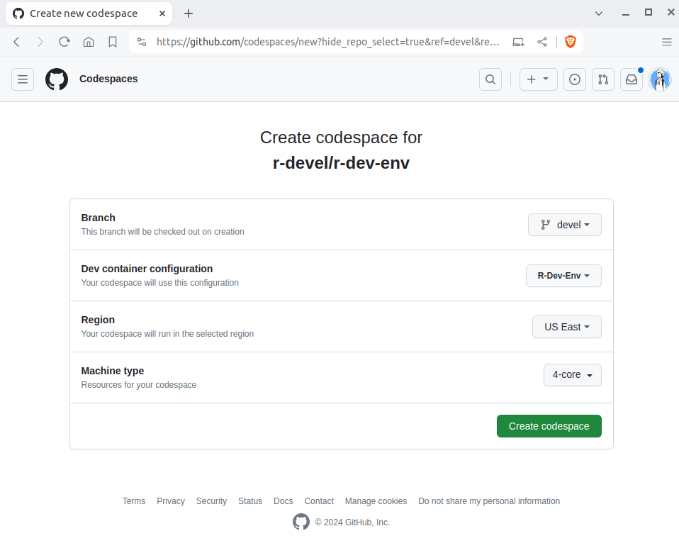

#### 1. Create a Codespace

From the main branch of the
[r-dev-env repo](https://github.com/r-devel/r-dev-env/tree/main),
 click on the 'Open in GitHub Codespaces' button and then click
 the green 'Create Codespace' button.

!!! Note
    You will see the message "Codespace usage for this
    repository is paid for by ...", with your username. Don't panic!

    GitHub Codespaces offers 120 core hours of free usage per month for every GitHub user.
    So the actual number of free hours is 120 divided by the number of cores you are using
    to run your codespaces.
    For the r-dev-env codespace we have set the codespace usage to 4 cores which leads to
    30hrs of free usage per month. This can be changed according to your preference.

- For more details about codespaces billing, see the [Codespaces Billing Docs](https://github.com/features/codespaces).
- You can calculate your GitHub services usage with the 
  [GitHub Services Pricing Calculator](https://github.com/pricing/calculator)
- Check your usage allowance under "Codespaces" on your [GitHub Billing page](https://github.com/settings/billing).

#### 2. Wait for Container Setup

The codespace setup screen will then be shown. Starting the container may
take a minute or so.

#### 3. Access VSCode in Browser

You will be taken to a VSCode editor within your browser.

