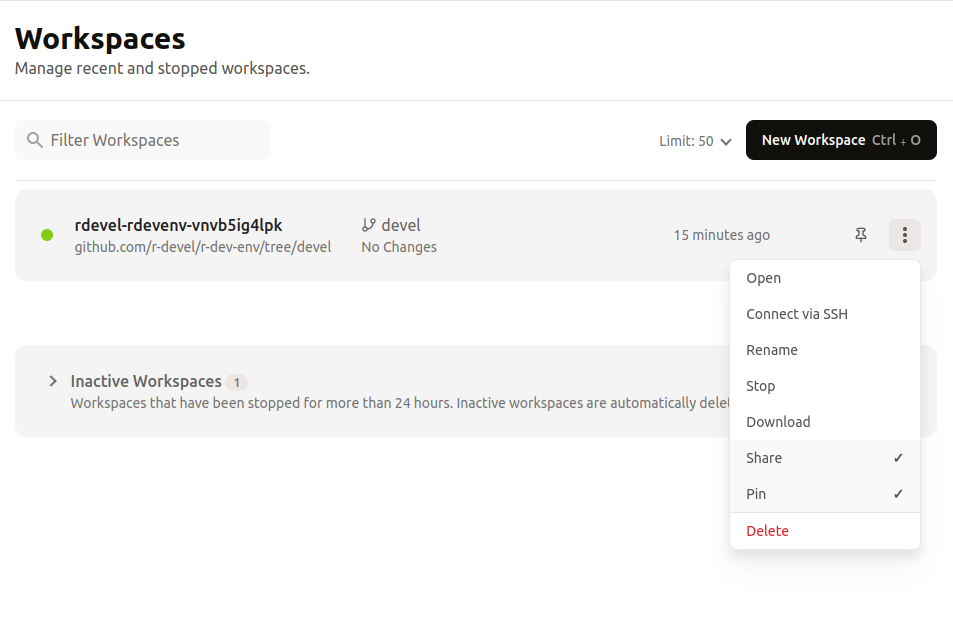
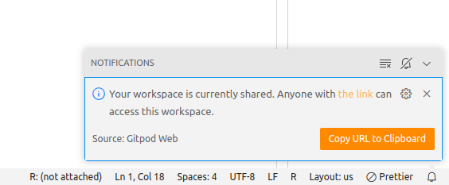

#### 1. Start Live Share from Dashboard
`Share` option on dashboard.

#### 2. Live Share Enabled in Workspace

After that whenever you open Gitpod Workspace the live share is enabled
and ready to share workspace with others.

!!! Note
    The live share will be enabled even if you close the workspace.
