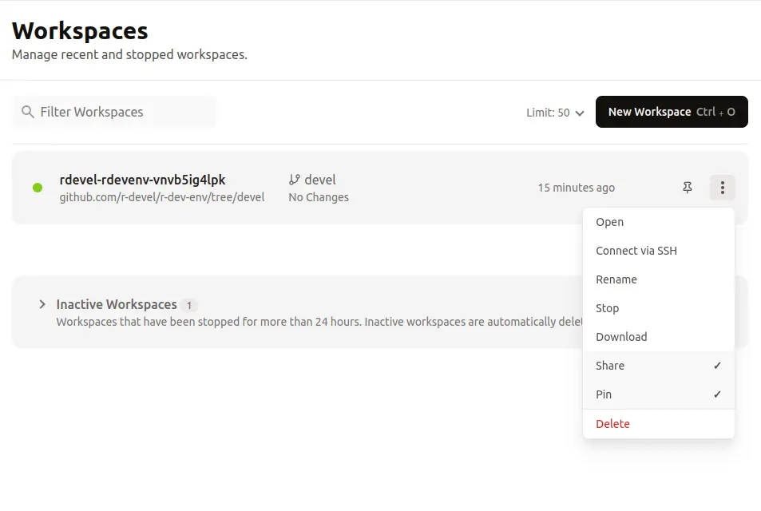
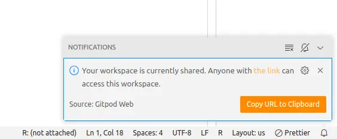

## Gitpod Live Share Alternative

1. Gitpod live share can be started from dashboard itself by clicking on `Share`
   option on dashboard.

    

2. After that whenever you open Gitpod Workspace the live share is enabled and
   ready to share workspace with others.

    

    !!! Note
        The live share will be enabled even if you close the workspace.
