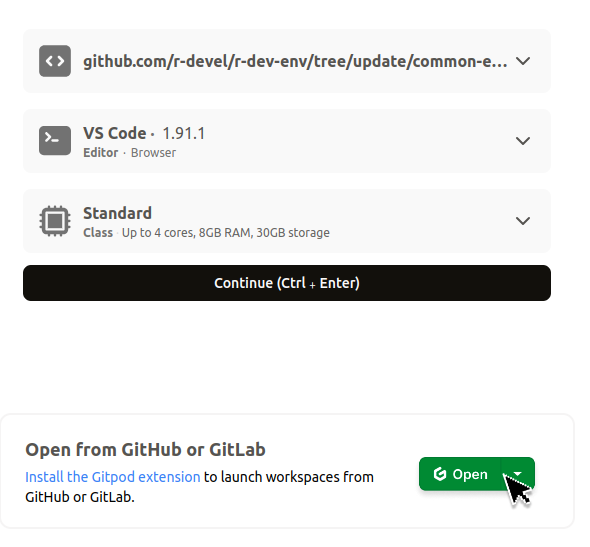

# Starting a Gitpod Workspace

Go to the [Gitpod login page](https://gitpod.io/login/) and sign in with your GitHub,
GitLab, or Bitbucket account. This allows Gitpod to create workspaces from your
repositories.

#### 2. Create a workspace

To create a workspace using the R Dev Container repo,
click the Gitpod badge below to open the Gitpod workspace creation dialog with the
relevant options pre-filled:

<figure markdown="span">
{:target="_blank"}
</figure>

<figure markdown="span">
{width="70%"}
</figure>

Click the "Continue" button in the Gitpod dialog to create a workspace.
It will take approximately 15-20 minutes to create the workspace for the
first time. The environment will be cached for faster startup in the future.

!!! Note
    Changing the resource option from Standard to Large will reduce the free
    monthly Gitpod usage, which is 50 hours per month of Standard workspace
    usage. See the [billing](https://www.gitpod.io/docs/configure/billing) docs
    for more information.
