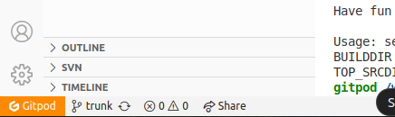

## Stopping a Gitpod Workspace

#### 1. Locate the Gitpod Command Palette Button

button in the bottom left corner of the workspace.

#### 2. Open the Command Palette and Stop the Workspace

stop the current workspace.

!!! Note
    Stopping a workspace will save its state, so you can resume later
    without losing your progress.
## Restarting a Gitpod Workspace

#### 1. Open Gitpod Dashboard

Once you're in the Gitpod dashboard, navigate to the "Workspaces" section.
In the "Workspaces" section, you will see a list of your current and past
workspaces. Locate the workspace you want to restart. Stopped workspaces

#### 2. Restart the Workspace

## Managing and Sustaining Codespaces
#### Gitpod Workspace Pinning

**Purpose:** Workspace pinning prevents important workspaces from being
automatically deleted.

**Pinned Workspace:** A workspace that has been pinned will never be deleted,
regardless of inactivity or other automated processes.

- Navigate to your workspace list in the Gitpod dashboard.
- Identify the workspace you want to keep permanently.
- Pin the workspace to ensure it remains available and is not subject to
deletion.  

**Benefits:**

Protects critical projects or environments from accidental loss.  Ensures
long-term availability of specific workspaces that you frequently use or need to
preserve.
