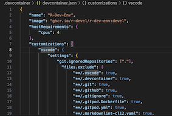

## Updating Docker Image

There are Docker images for the different chip architectures - either AMD or ARM.

When opened in VSCode, the code will start to build the Docker container using the devcontainer.json file. This currently starts a version developed for AMD chips and will be slow on a Mac that uses Apple Silicon or any other ARM based machine.

The devcontainer to be used can be updated if you need an ARM container.

### Pull Container

The main [container repository](https://github.com/r-devel/r-dev-env). Please check there for the available.

You can pull a container from a repository to add this to your Docker environment.

```bash
docker pull ghcr.io/r-devel/r-dev-env:devel
```

This will pull the image from the remote repository to your machine. This command can also be used to update the local image if the remote one has changed. You may need to change the final ```devel``` to the correct container.

### Change Container

Open up the devcontainer.json.



Change the "image" tag on the second line to the correct one.

Once this change has happened, please restart the [DevContainer](localsetup.md).
