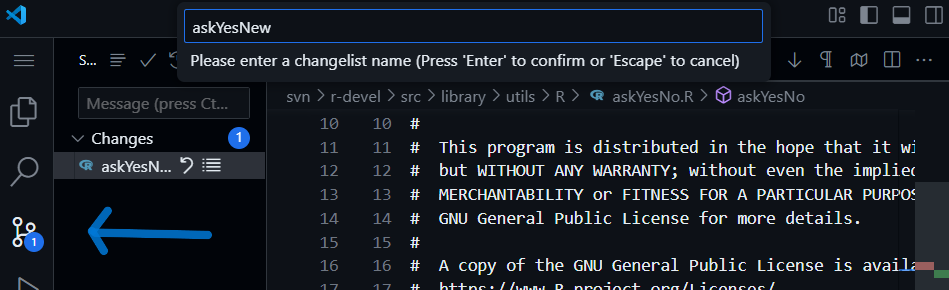
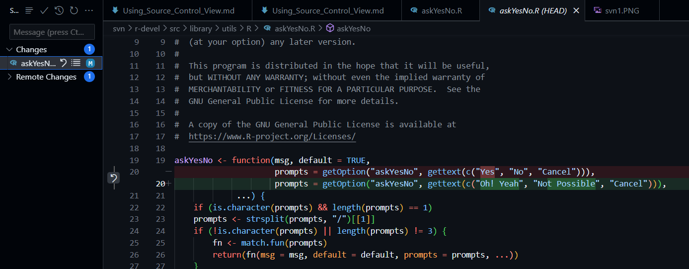
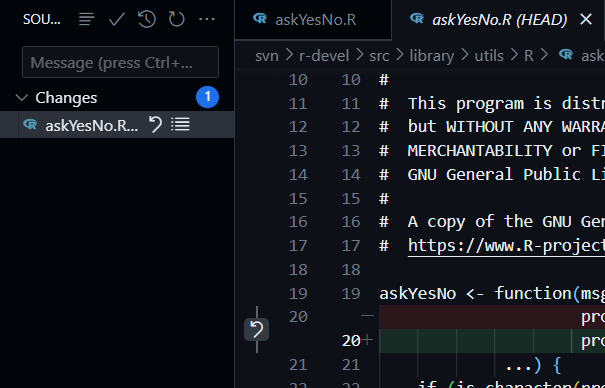
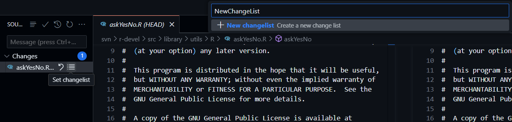
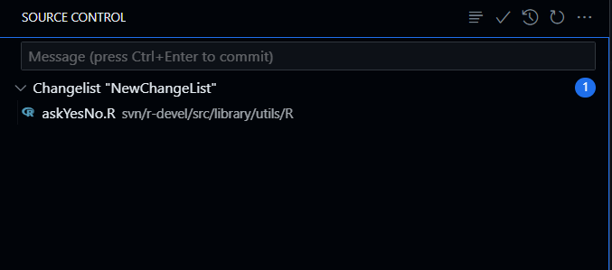
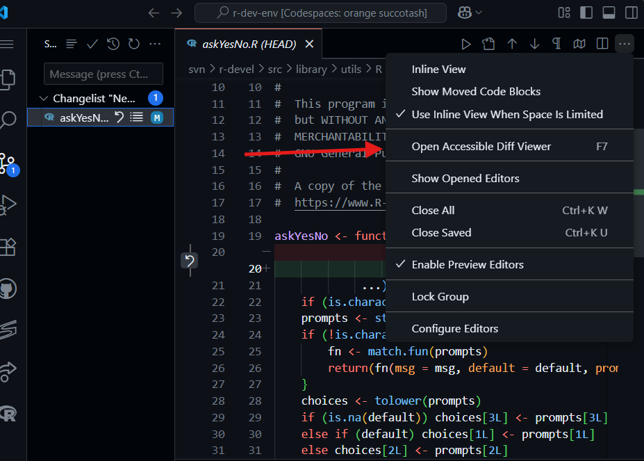
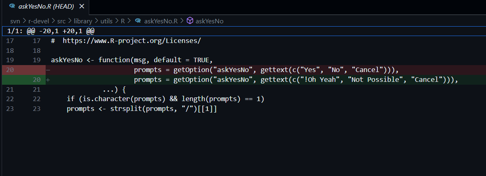
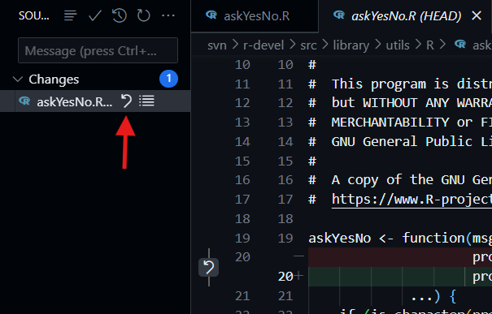
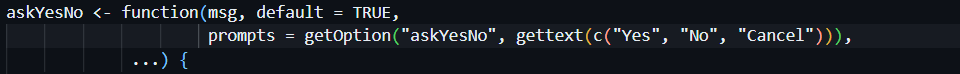
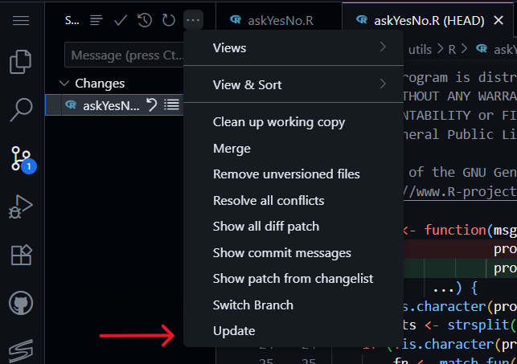

### Where to find ***"Source Control"*** ?

(`Ctrl + Shift + G`)


### What exactly Source Control is ?

1. Source Control in Visual Studio Code (VS Code) is a built-in feature that helps you
   to track, manage, and collaborate on code changes using version control systems,
   especially Git.

2. Source Control tracks every change you make to your code, lets you undo mistakes,
   and helps you work with others.

3. *for example*:- *Let's take a example rewriting a code of askYesNo() function which we have seen
    previously in*
    [contribution_workflow.md](https://upgraded-computing-machine-4j6p6p44q5vvcq74x-8000.app.github.dev/tutorials/contribution_workflow/)

*



### What are the different features of Source Control?

Shows all modified, added, deleted, and renamed files since the last commit.

***Files are grouped into:***

* Changes ->
  * Files that have been modified, created, or deleted but not     yet staged.
  * These are shown uncommitted.

     

### How to make a Change List ?

   

* Enter the name of your change-List

  After just Press `Enter` to create a Change-List for your Changes

   

* ***Open Accessible Diff Viewer: (`F7`)***

    
  * View your changes(Diff) made at Present:(`F7`)
  * 

* ***Revert Changes***
  * All the edits we have done in askYesNo() function will undone
  * 

  * Output:
    * 

  * **Note:**
      *Creating a Change-List for your changes helps you revert a block of changes,
       undoing all of them at once.*

* **Note:**
      *When we restart our VSCode, Codespace session, or workspace, it forgets about the
       SVN repository that we fetched.*

  * *The svn command lets you recognize your fetched SVN repository again in the Source Control panel.*

    ```bash
         cd $TOP_SRCDIR
         svn update
     ```

* ***Update:***
  * The Update option shown in the image below provides the same output as the command mentioned above.

  * 
