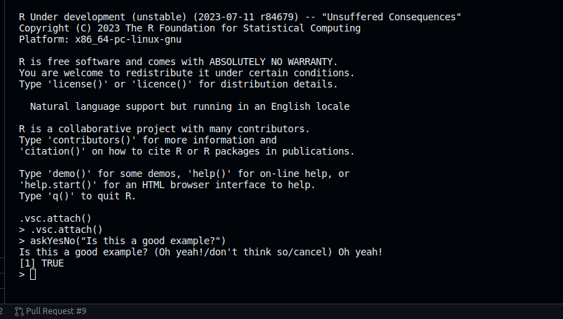

## Contribution Workflow

#### 1. Example Contribution Workflow using DevContainer:
-  To start working in R we will click on `R:(not attach)` option which is in the bottom right of our R-dev codespace. It will open R terminal for us.
     
    

    

-  We can now run R commands. We will use the `utils::askYesNo()` function as an example
    
    

```R
    > askYesNo("Is this a good example?")
    Is this a good example? (Yes/no/cancel) Yes
    [1] TRUE 
```

#### 2. Editing Source Code
- Edit the source code of `utils::askYesNo()` to change the default options. The source code can be found in `$TOP_SRCDIR/src/library/utils/R/askYesNo.R`.

**> Before edit:**


    
```R title="askYesNo.R" linenums="20"
    prompts = getOption("askYesNo", gettext(c("Yes", "No", "Cancel"))),
```

**> With edit (for example - change to whatever you like!):**


```R title="askYesNo.R" linenums="20"
    prompts = getOption("askYesNo", gettext(c("Oh yeah!", "Don't think so", "Cancel"))),
```

#### 3. Rebuilding Package
- Re-build the utils package (we only need to re-build the part we have modified). 
We can rebuild the package by following simple steps.
- First we need to be inside $BUILDDIR, for that we can change directory to `cd $BUILDDIR`.
- After that we can run cmd `make` and `make check` in a series.
```bash
make
make check
```
    


- This will re-build any parts of R that have changed, in this case only re-building the utils package, then re-install R. If we open a new R terminal we will see our changes getting reflected.

#### 4. Cross check and Re-running Code 
- Check the edit has worked as expected by re-running the example code:


```R
    > askYesNo("Is this a good example?")
    Is this a good example? (Oh yeah!/don't think so/cancel) Oh yeah!
    [1] TRUE
```
