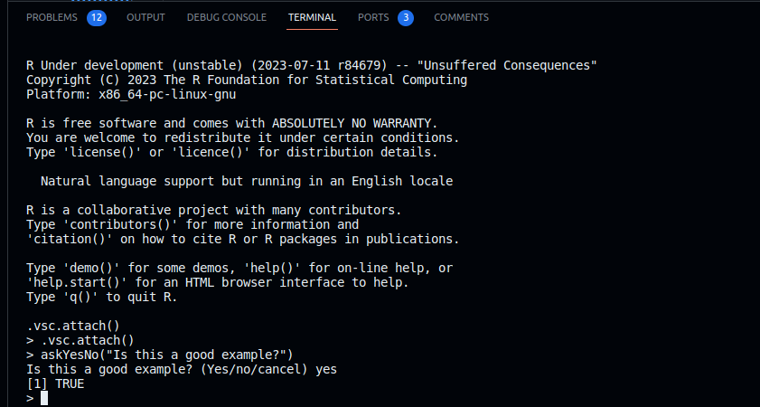
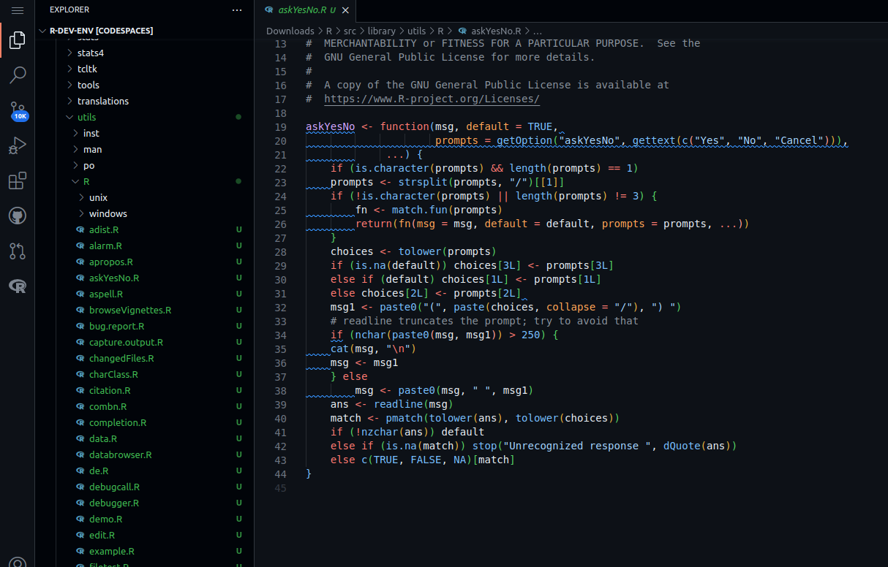
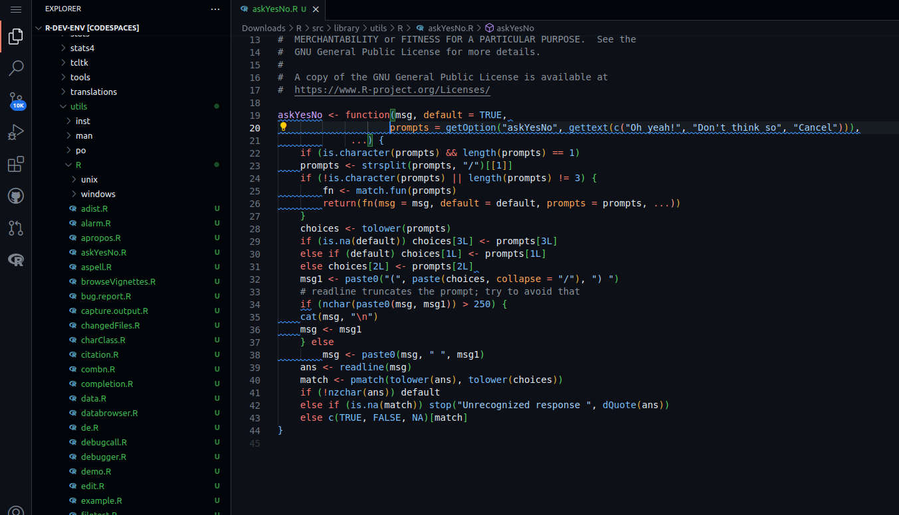

#### 1. Example Contribution Workflow using the R Dev Container

To start working in R we can use one of the following methods to open an R 
terminal for us.

##### Method 1: Using the Command Palette

  1. Open the command palette:
      - Press `Ctrl + Shift + P` (Windows/Linux) or `Cmd + Shift + P` (Mac)
      - If using Firefox and this opens a private window, press `F1` instead
      - Or select **View > Command Palette** from the top menu bar
  2. In the command palette, type "R terminal"
  3. Or from the dropdown list, click on "R: Create R terminal"

##### Method 2: Using the Status Bar

  If you have an R file open in VS Code:

  1. Look for "R:(not attached)" in the status bar at the bottom-right corner
  2. Click on "R:(not attached)" to launch an R terminal

Both methods will open an R terminal, allowing you to run R commands directly
in VS Code.


    

    

We can now run R commands. We will use the `utils::askYesNo()` function as an
  example

    

```R
    > askYesNo("Is this a good example?")
    Is this a good example? (Yes/no/cancel) Yes
    [1] TRUE
```

#### 2. Editing Source Code

- Edit the source code of `utils::askYesNo()` to change the default options. The
  source code can be found in `$TOP_SRCDIR/src/library/utils/R/askYesNo.R`.
- You can redirect to that file using

```bash
code $TOP_SRCDIR/src/library/utils/R/askYesNo.R
```

**> Before edit:** 

```R title="askYesNo.R" linenums="20"
    prompts = getOption("askYesNo", gettext(c("Yes", "No", "Cancel"))),
```

**> With edit (for example - change to whatever you like!):**



```R title="askYesNo.R" linenums="20"
    prompts = getOption("askYesNo", gettext(c("Oh yeah!", "Don't think so", "Cancel"))),
```

#### 3. Rebuild R

- We can re-build R with our changes. Since we have only modified the utils
  package, rebuilding R will only re-build the utils package.
- First we need to be inside $BUILDDIR.
- Quit R with `q()` or by closing the R terminal.
- In the bash terminal, change to the build directory:

```bash
cd $BUILDDIR
```

- Now run the `make` command to rebuild R with the changes you made in
  step 2. This will be much faster than the full build!

```bash
make
```


- Optionally run `make check` to run R's test suite with your local changes. You
  may skip this step while you are iterating on a bug fix or other development,
  until you are ready to [create a patch](./patch_update.md).

- To use the re-built R, simply open a new R terminal.

#### 4. Cross check and Re-running Code

- Check the edit has worked as expected by re-running the example code: 

```R
    > askYesNo("Is this a good example?")
    Is this a good example? (Oh yeah!/don't think so/cancel) Oh yeah!
    [1] TRUE
```
