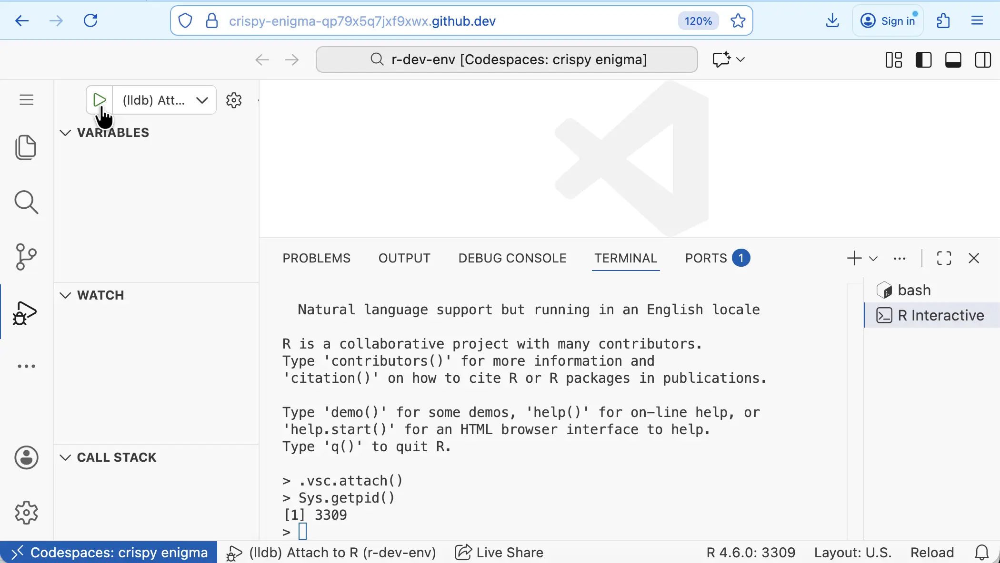
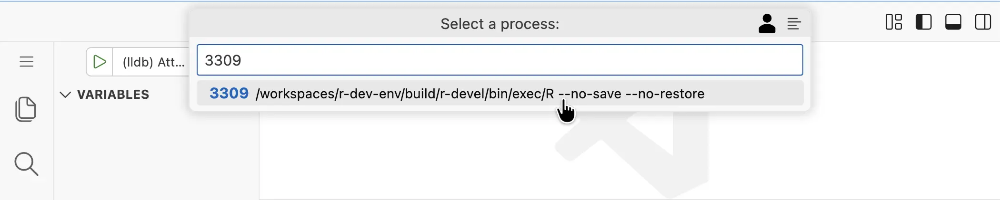
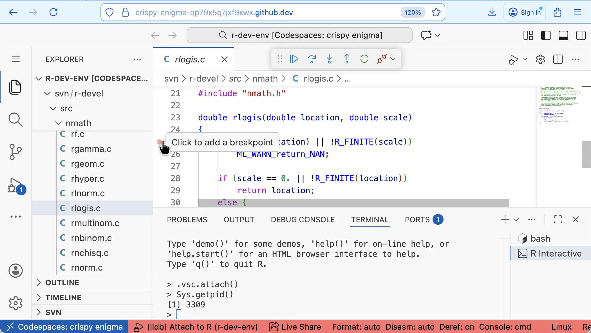
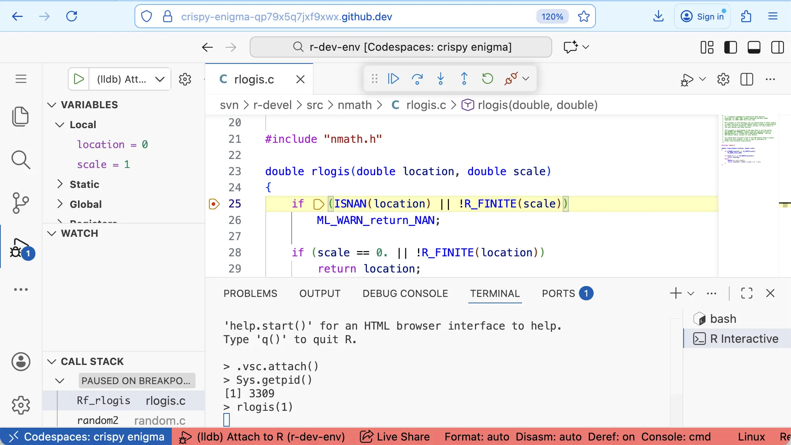
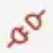
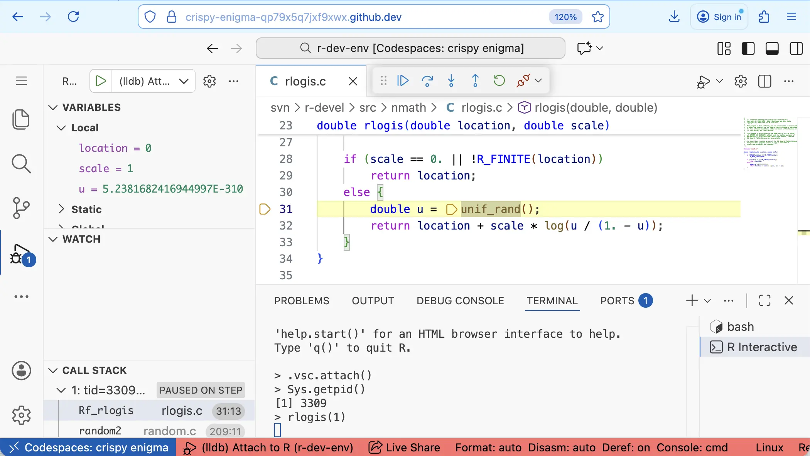
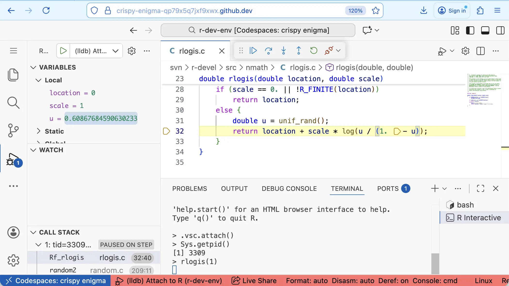
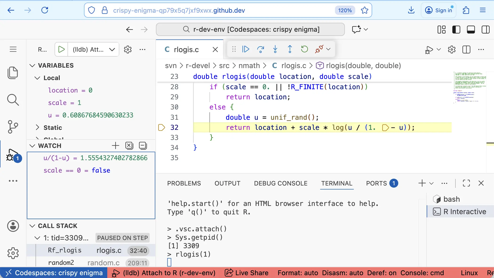
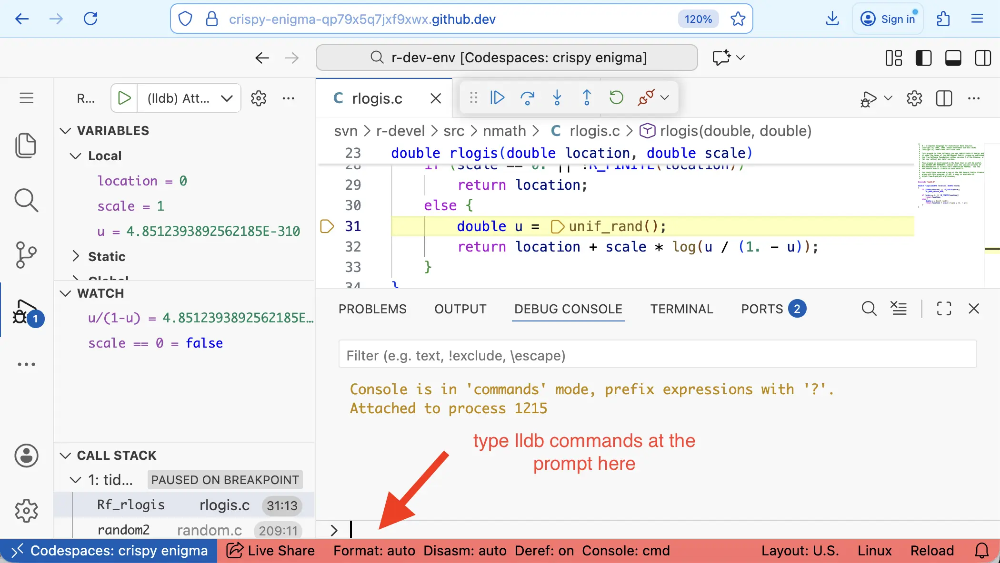

This tutorial introduces debugging C code with LLDB (the Low-Level Debugger)
via VS Code's Run and Debug functionality. It is also possible to use lldb
via the command line using bash terminals in the R Dev Container.

#### 1. Open an R Terminal Running R Built from Source

If necessary, run `which_r` to switch to a version of R you have built
following the [Building R](building_r.md) tutorial.[^1]

Then open an R terminal by clicking on `R: (not attached)` in the status bar,
or running `R: Create R terminal` from the VS Code command palette.

#### 2. Attach LLDB to the Running R Process

Find the process ID (PID) of your R session, by calling `Sys.getpid()` in R:

```r
Sys.getpid()
```

The PID is also shown after the R version number in the status bar (you may
need to deselect some of the statuses shown to see the status for R).

Open the "Run and Debug" sidebar and click the green arrow next to the
drop-down box at the top.



This will open a dialog for you to enter the PID:



When you enter the PID the corresponding process is shown underneath -
click on it to select that process for LLDB to attach to.

#### 3. Set a Breakpoint in C Code

For example, to debug the `rlogis` C function, open
`$TOP_SRCDIR/src/nmath/rlogis.c` and set a breakpoint by clicking to the left
of the line number corresponding to the first line in the body of the function:



#### 4. Trigger the Debugger

In the R terminal, run the `rlogis()` command, which calls the `rlogis` C
function:

```r
rlogis(1)
```

This will trigger the LLDB debugger and pause at the line where the
breakpoint was added:



#### 5. Using the Debugger Toolbar

After pausing at a breakpoint, use the LLDB
toolbar buttons and commands to control execution:

- **Continue/Pause** ({.icon}
or F5): Resume running until the next breakpoint or the end of the call from
R. This changes to a pause button
({.icon}) when the code is running,
allowing you to pause execution.
- **Step Over** ({.icon} or F10): Run the
 current line of code and stop at the next line.
- **Step Into** ({.icon} or F11): Run the
 current line of code and step into the next function called to start debugging
 the code in that function.
- **Step Out** ({.icon} or Shift+F11): Run
 the remainder of the current function and stop at the point where the function
 was called. This will step out through several internal C functions in the
 call stack - use
**Continue** instead to finish and return to R.
- **Restart** ({.icon} or Cmd/Ctrl+Shift+F5):
 Start again from the beginning.
- **Disconnect** ({.icon} or Shift+F5):
 Detach the debugger but keep R running.
- **Stop** (access from more controls): Teminate the debugging session and
the R process (closes the R terminal).

#### 6. Inspect Variables and Expressions

The Variables sub-panel of the Run and Debug side panel shows the current value
of variables in the current environment. This is particularly helpful for
local variables defined in the function, e.g. before `u` is defined:



and after



In the Watch sub-panel we can define expressions to watch as we step through
the code. For example, we might watch `u / (1 - u)` and `scale == 0`:



Note these expressions can only use simple operations, for example, we can't
watch `log (u / (1 - u))` as this uses the `log` function.

The watch panel can also be used to dereference pointers (e.g. `*ptr`) or
access elements of an array (e.g. `array[5]`).

#### 7. Using the Debug Console

Using the Debug Console, we can interact with LLDB via the command line,
enabling more advanced debugging.



##### Stepping through the code

These commands are equivalent to the debug toolbar buttons

- `c` continue
- `n` next (Step Over)
- `s` step into

##### Navigating the call stack

These commands are equivalent to selecting function names in the Call Stack
sub-panel of the Run and Debug panel.

- `up` shows the next level up in the call stack (also, `down`)

##### Setting breakpoints

- `break set -n FUNC_NAME` to set a breakpoint at the start of the function,
e.g.
  - `break set -n C_plotXY` to set a breakpoint in `C_plotXY`
  - `break set -n Rf_logis` to set a breakpoint in `rlogis`[^2]
- `break set -l 31` sets a breakpoint at line 31 of the current file
- `breakpoint delete` deletes **all** breakpoints

##### Values, expressions and calls

- `print x` prints x, where `x` is a simple expression with the same
restrictions as for the Watch sub-panel
- `expr x` evaluates C expression `x`. For example
  - Modify the value of objects: `expr u = 0.2`
  - Call functions, defining the return type:
      `expr (double) log(u / (1 - u))`
- `call FUNC_NAME()` runs a C function in the debugger. We can use this to run C
functions defined in R[^2], e.g.

    ```c
    call Rf_rgamma(10.0 / 2.0, 2.0)
    ```

    ```text
    (double) $2 = 10.161318250826971
    ```

    ```c
    call Rf_PrintValue(x)
    ```

    Note the second call asks R to print the value of x, so the output will
    appear in the **R terminal**, not the debug console. This can be useful
    for printing `SEXP` objects.
<!--
Using `expr` to compile and run a C expression is a feature of LLDB
vs GDB
-->

<!--
Not so helpful lldb commands:
- `q` or `quit`: does not seem to have any effect in VS Code
-->

[^1]: Debugging C code requires R to have been built with `CFLAGS="-g -O0"`.
This will not be the case for binary installs (such as the version of R
pre-installed in the container) or R built following the Building R tutorial
for R Dev Container ≤ v0.3.
[^2]:
   C function names in R are internally prefixed (usually with `Rf_` or `R_`) to
   avoid name collisions. If the name in the function definition does not have
   a prefix, this means a header file maps the unprefixed name to a
   prefixed name. Search the R sources for `#define FUNC_NAME` to find the
   mapping, e.g. `#define rlogis Rf_logis` in
   `$TOP_SRCDIR/src/include/Rmath.h0.in` tells us we must use `Rf_logis` as the
   function name in lldb commands like `break set -n` and `call`.
