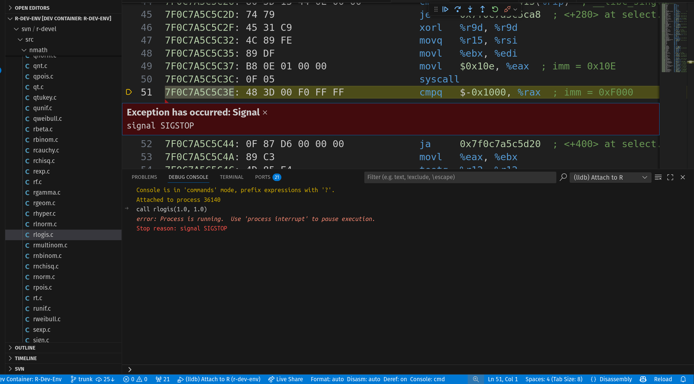
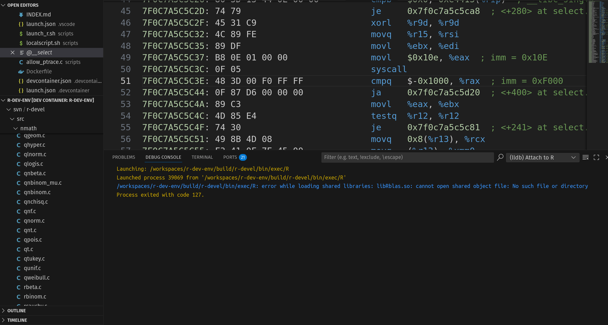

#### 1. Go to the Source Directory

Rebuild R with debugging symbols so LLDB can access C source lines and
variables. Make sure your build uses the `-g` flag. Open a bash terminal
and navigate to the root of your project’s source directory.

```bash
cd $TOP_SRCDIR
```

#### 2. Run R Using the Debug Wrapper Script

Run R through the wrapper script (`launch_r.sh`) that
sets up `LD_PRELOAD` and debugging environment:

```bash
./scripts/launch_r.sh
```

This ensures the ptrace helper library is loaded
for debugging support.

#### 3. Attach LLDB to the Running R Process

Find the process ID (PID) of your R session. You
can do this within R, Start an R terminal by using
the command R in the terminal,then:

```r
Sys.getpid()
```

Attach LLDB to this PID, using the command palette type
`LLDB: Attach to Process` then select the PID you just
got or you can do this via the terminal:

```bash
lldb -p <PID>
```

#### 4. Set a Breakpoint in Native C Code

For example, to debug `rlogis.c`, set a breakpoint at
the start of its function in `rlogis.c` (line 25):

```lldb
breakpoint set --file rlogis.c --line 25
```

You can do this by clicking the r
ed dot on the left side
of a line in a program as shown i
n the screenshot below:


#### 5. Trigger the Function in R

Use this command directly in the LLDB debug
console to call the C function and see its
result:

```lldb
expr (double)rlogis(1.0, 1.0)
```

This will activate your breakpoint and pause
at the specified line for inspection as shown
below.



#### 6. Debugging Actions in LLDB

After pausing at a breakpoint, use the LLDB
toolbar buttons and commands to control execution:

- **Continue Execution:** Resume running until
the next breakpoint (Run icon ▷ in blue).
- **Step Through the Code:** Move line-by-line,
stepping into functions (Step Into ↓ in blue)
or stepping out of the current function
(Step Out ↑ in blue).
- **Stop Execution:** Pause the running process
(interrupt command, icon may not always be shown).
- **Additional Controls:**
ack (↶ in blue) for reverse debugging
    if available.
t (⟲ in green) to restart the session.
nect (🔗 in orange) to detach the debugger
    while leaving the process running.

Use these controls to navigate and inspect your native
C code during debugging within R.

#### 7. Inspect Variables and Expressions

LLDB allows watching variables and
evaluating expressions. For example,
in the context of debugging `rlogis`,
you can inspect the variable `u` or
watch the result of an expression:

```lldb
expr u
expr log(u / 1.0 - u)
```

The side panel or variable/watch
window updates as you step through
the code. Finally, when you exit
the debugger using the disconnect
button or te exit command, the
screen shown below is displayed:


