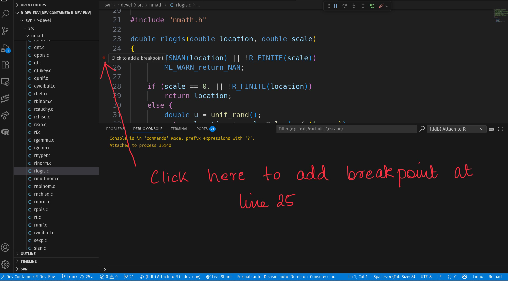

This tutorial introduces debugging C code with LLDB (the Low-Level Debugger)
via VS Code's Run and Debug functionality. It is also possible to use lldb
to debug R via the command line using bash terminals in the R Dev Container.

#### 1. Open an R Terminal Running R Built from Source

If necessary, run `which_r` to switch to a version of R you have built
following the [Building R](tutorials/building_r) tutorial.

Then open an R terminal by clicking on `R: (not attached)` in the status bar,
or running `R: Create R terminal` from the VS Code command palette.

<!-- markdownlint-disable MD046 -->
!!! Note
Debugging C code requires R to have been built with `CFLAGS="-g -O0"`.
<!-- markdownlint-enable MD046 -->

#### 2. Attach LLDB to the Running R Process

Open the "Run and Debug" sidebar and click the green arrow next to the
drop-down box at the top. This will open a dialog for you to select the
process to attach the LLDB debugger to.

[screenshot here]

Enter the process ID (PID) shown after the R version number in the status bar,
e.g. here the PID is [TBA]

[screenshot here]

<!-- markdownlint-disable MD046 -->
!!! Note
    If you can't see the R version number in the status bar, you can get the PID
    by calling `Sys.getpid()` in R before starting debugging.
<!-- markdownlint-enable MD046 -->

#### 3. Set a Breakpoint in C Code

For example, to debug the `rlogis` C function, open
`$TOP_SRCDIR/src/nmath/rlogis.c` and set a breakpoint by clicking to the left
of the line number corresponding to the first line in the body of the function:



#### 4. Trigger the Debugger

In the R terminal, run the `rlogis()` command, which calls the `rlogis` C
function:

```r
rlogis(1)
```

This will trigger the LLDB debugger and pause at the line where the
breakpoint was added:

[new screenshot here]

#### 5. Using the Debugger Toolbar

After pausing at a breakpoint, use the LLDB
toolbar buttons and commands to control execution:

- **Continue/Pause** (▷ in blue, or F5): Resume running until the next
breakpoint or the end of the call from R. This changes to a pause button
(⏸ in blue) when the code is running, allowing you to pause execution.
- **Step Over** (↷ in blue, or F10): Run the current line of code and stop
at the next line.
- **Step Into** (↓ in blue, or F11): Run the current line of code and step
into the next function called to start debugging the code in that function.
- **Step Out** (↑ in blue, or Shift+F11): Run the remainder of the current
function and stop at the point where the function was called. This will step
out through several internal C functions in the call stack - use
**Continue** instead to finish and return to R.
- **Restart** (⟲ in green, or Cmd/Ctrl+Shift+F5): Start again from the
beginning.
- **Disconnect** (🔌 in red, or Shift+F5): Detach the debugger but keep R
running.
- **Stop** (access from more controls): Teminate the debugging session and
the R process (closes the R terminal).

#### 6. Inspect Variables and Expressions

The Variables sub-panel of the Run and Debug side panel shows the current value
of variables in the current environment. This is particularly helpful for
local variables defined in the function, e.g. before `u` is defined:

[screenshot]

and after

[screenshot]

In the Watch sub-panel we can define expressions to watch as we step through
the code. For example, we might watch `u / (1 - u)` and `scale == 0`:

[screenshot]

Note these expressions can only use simple operations, for example, we can't
watch `log (u / (1 - u))` as this uses the `log` function.

The watch panel can also be used to dereference pointers (e.g. `*ptr`) or
access elements of an array (e.g. `array[5]`).
