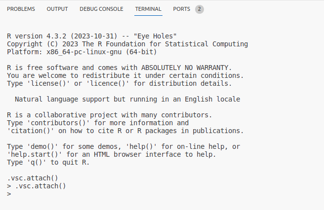

1) Create a file in VS Code ending with a .R extension. You can create new files by clicking on the new file icon in VS Code Explorer, or use the `code` command in the terminal to create and open R file
```bash
code R/test.R
```


2) You should see `R:(not attached)` in the Status Bar at the bottom of the VSCode window.


3) Click on the `R:(not attached)` link to launch R in the terminal. You can then send code from the .R file to the R terminal by pressing `cmd/ctrl + enter`.



