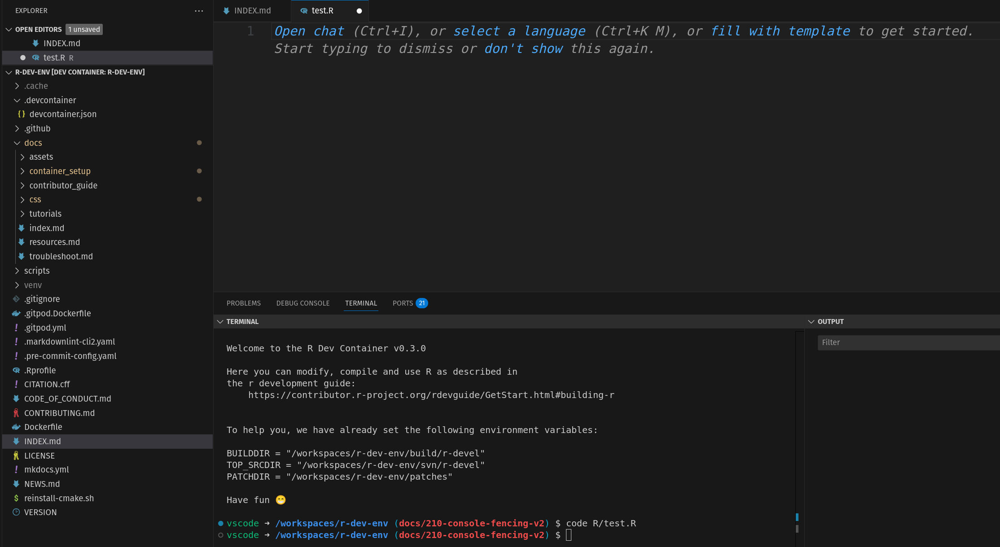
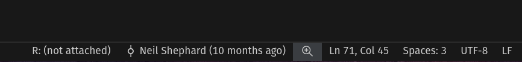
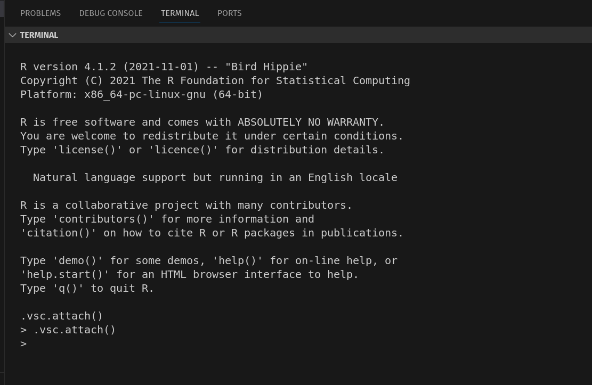
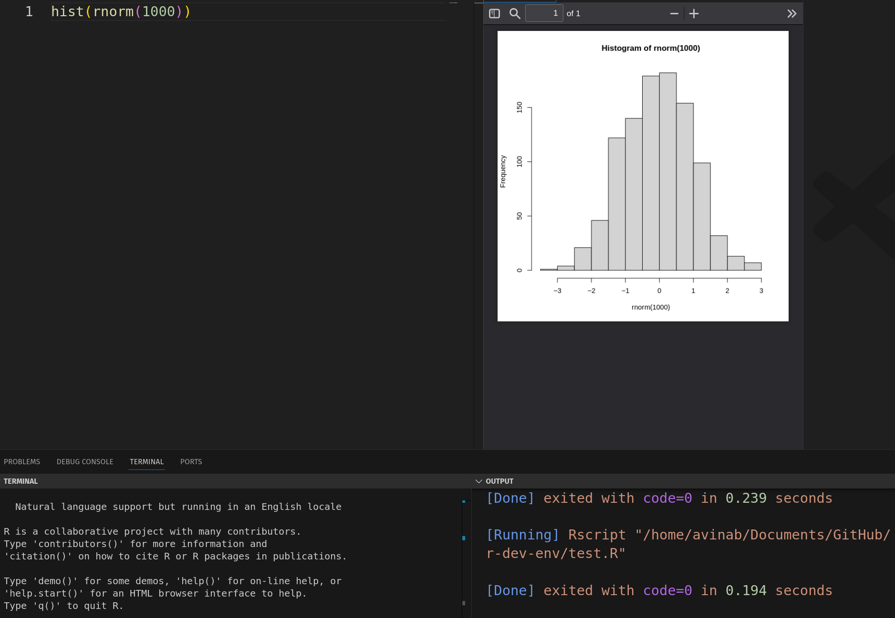

1) Create a file in VS Code ending with a .R extension. You can create new files
by clicking on the new file icon in VS Code Explorer, or use the `code` command
in the terminal to create and open an R file

```bash
code R/test.R
```



2) You should see `R:(not attached)` in the Status Bar at the bottom of the
VSCode window.



3) Click on the `R:(not attached)` link to launch an R terminal. You can then
send code from the `.R` file to the R terminal by pressing `cmd/ctrl + enter`.




